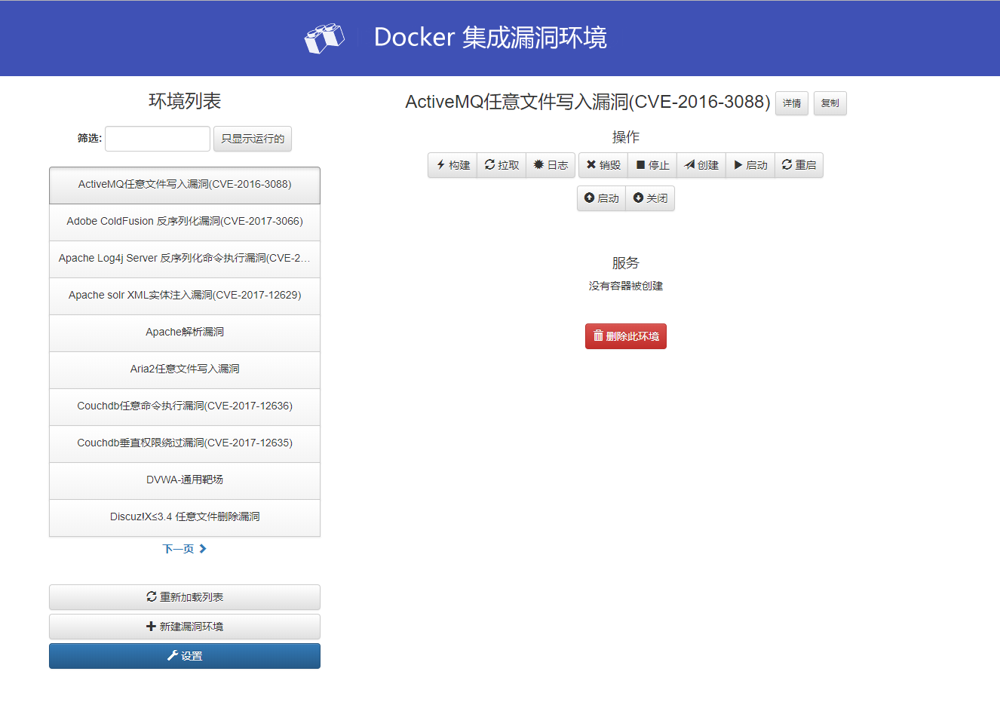
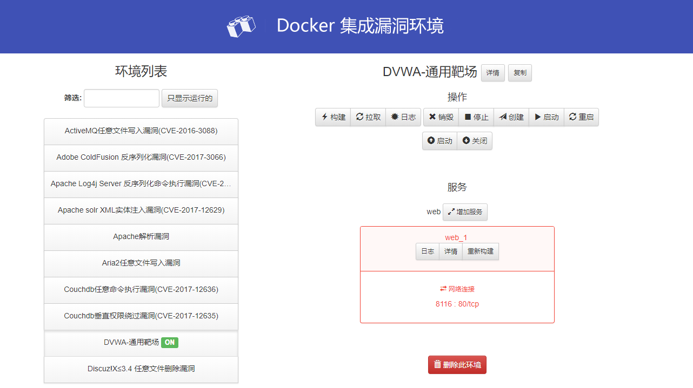
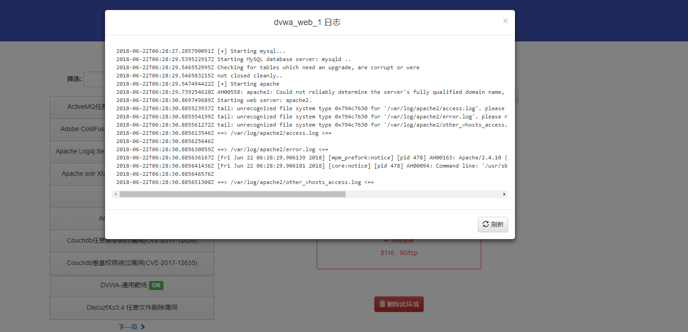

# Docker 集成靶场环境(Web版)

#### 基于docker-compose-ui + vulhub
原地址：

https://github.com/francescou/docker-compose-ui

https://github.com/vulhub/vulhub

```
靶场环境文件更新说明：
1. 创建漏洞名称文件，如“Apache解析漏洞”
2. 编写漏洞环境的dockerfile文件
3. 编写漏洞环境所需的容器配置文件docker-compose.yml
4. 编写漏洞的简要原理和利用过程
```

### 更新日志
#### 2018-04-27
+ 同步vulhub漏洞环境
+ DVWA-通用靶场
+ 新增WebGoat 8 Web漏洞靶场
+ 新增S2-055漏洞环境
+ Spring messaging Spel 代码执行漏洞(CVE-2018-1270)
+ 更新说明文档

#### 2018-06-22
+ 同步vulhub漏洞环境
+ 更新说明文档(新增运行截图,使用详情)


### 使用
#### 快速部署
* 拉取镜像
> `docker pull creatorx/docker-vuln-repo-weekly`

* 启动容器
> `docker run --name docker-vuln-repo -p 5000:5000 -w /opt/docker-compose-projects/ 
-v /var/run/docker.sock:/var/run/docker.sock creatorx/docker-vuln-repo-weekly`

#### 源码运行
`git clone https://github.com/XoneStar/docker-vuln-repo.git`

`cd docker-vuln-repo`

`sudo docker-compose up`

or build with Dockerfile

`sudo docker build -t docker-vuln-repo .`

`docker run --name docker-vuln-repo -p 5000:5000 -w /opt/docker-compose-projects/ 
-v /var/run/docker.sock:/var/run/docker.sock docker-vuln-repo`

### 运行效果
* 显示漏洞列表，点击具体漏洞显示操作，一般情况点击启动和关闭即可。

* 漏洞环境启动后，显示暴露的端口，根据相应的端口访问相应的漏洞环境

* 漏洞运行日志


### 注意
本环境只适用于测试环境，请勿部署在正式环境下！！！！